# BeeU 

## Índice 

* [1. Descrição](#1-descrição)

* [2. Sobre o projeto](#2-sobre-o-projeto)

* [3. Pesquisa](#3-pesquisa)

* [4. Persona e história de usuário](#4-persona-e-história-de-usuário)

* [5. Prototipação](#5-prototipação)

* [6. Engenharia semiótica (signos)](#6-engenharia-semiótica-signos)

* [7. Ferramentas utilizadas](#7-ferramentas-utilizadas)

* [8. Considerações finais](#8-considerações-finais)

* [9. Autores](#9-autores)

***

## 1. Descrição

Projeto realizado durante o [**Bootcamp Laboratória - SAP005**]("http://laboratoria.la"), com intuito de criarmos uma rede social, que permita aos usuários criar, editar, deletar e dar likes em publicações.

## 2. Sobre o projeto

O tema escolhido foi o universo da beleza/estética. Com foco em valorização das características naturais humanas. 

Foram realizadas pesquisas através de formulários para conhecer melhor nossos possíveis usuários.

Clique [**Aqui**](https://sap005-social-network.firebaseapp.com/), para acessar a aplicação 
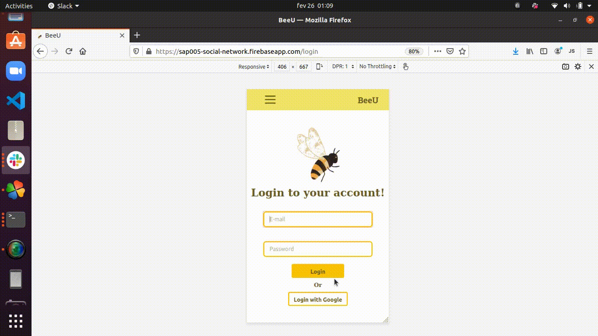
## 3. Pesquisa

De ínicio, quisemos entender melhor qual seria a relação dos usuários com a sua própria aparência:

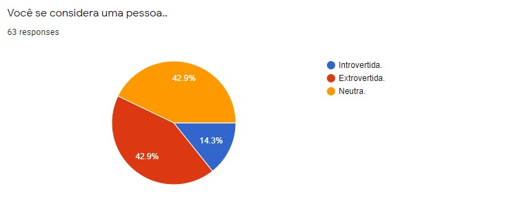

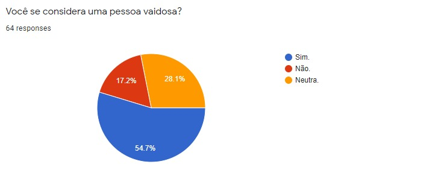

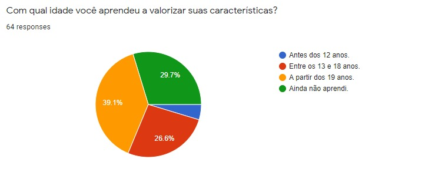

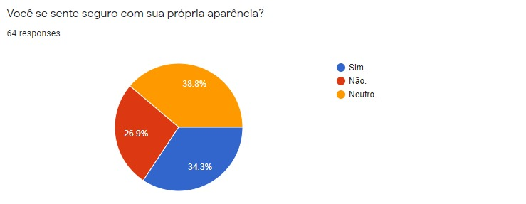

As perguntas seguintes foram para estudar o interesse dos usuários em uma aplicação com a temática da **BeeU** :honeybee: :

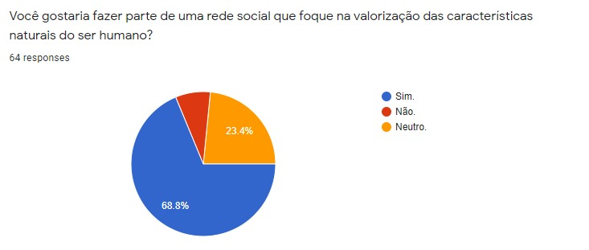

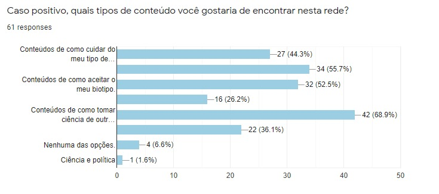

## 4. Persona e história de usuário

Com a pesquisa em mãos, foram definidas nossas *Personas* e a *História de Usuário*:

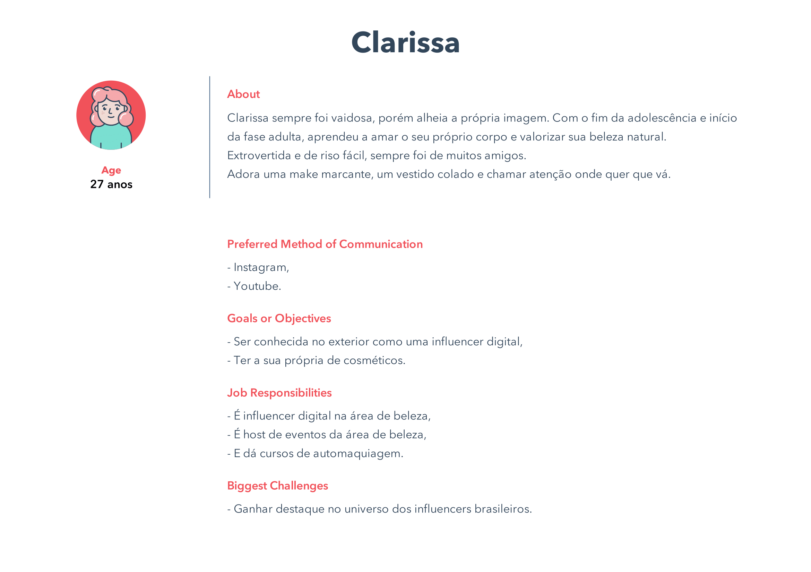

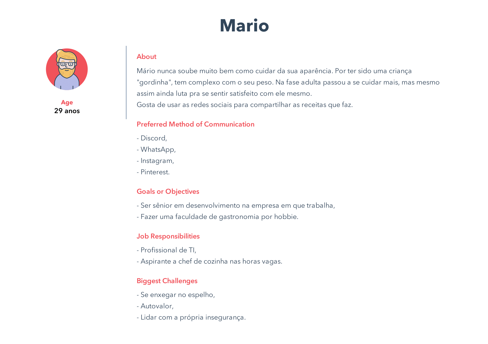

*"Eu, usuária/o, com média de idade de 19 a 30 anos, me considero uma pessoa de personalidade
neutra, que ainda não aprendi a valorizar e aceitar as minhas características físicas,
portanto gostaria de fazer parte de uma rede social que trate e discuta a diversidade
da beleza humana, com dicas e tutoriais de como cuidar do meu biotipo, tipo de pele e
cabelo (barba), onde eu possa compartilhar, curtir e comentar esse tipo de conteúdo."*

## 5. Prototipação

Com isto, criamos nosso prótipo:

## 6. Engenharia semiótica (signos)

### Cores da aplicação

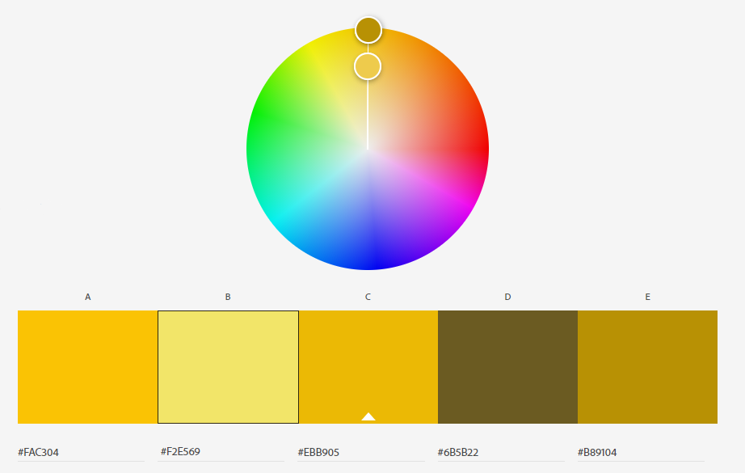

Dentro da psicologia das cores, a simbologia e o significado da cor amarela estão diretamente relacionados ao sol; por isso mesmo, é uma cor que evoca sentimentos de alegria, felicidade, otimismo e calor.

De um modo geral, o amarelo evoca a ideia de positividade, recreação e jovialidade.

### Logotipo

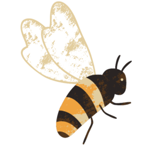

Muitos insetos são símbolos místicos em todo o mundo. No caso da abelha, esse significado
pode variar, mas costuma representar a imortalidade, o sacrifício, o amor, a ordem,
a limpeza, a comunidade e a obediência.
Na Grécia Antiga, também sabemos que as abelhas retratavam a alma e a sua transição deste plano para outro.

No **BeeU** :honeybee:, a simbologia da abelha retrata o companheirismo, comunidade, e a aceitação de como nós somos.

## 7. Ferramentas utilizadas

 Este projeto foi realizado utilizando as ferramentas abaixo:
  * Vs Code;
  * Google Forms;
  * Adobe Color;
  * Canva;
  * Figma;
  * GitHub.

## 8. Considerações Finais 

Agradecemos o auxílio e suporte de toda a equipe da Laboratória, nossas colegas de turma, e de nossos amigos e familiares, que a todo momento compartilharam conhecimentos e descobertas. Além de dispor de seu tempo para contribuir de diversas formas no nosso crescimento. :heart:

## 9. Autores

Projeto realizado por <a href="https://github.com/carolineshimada" target="_blank"> Caroline Shimada </a>, <a href="http://github.com/dunia07" target="_blank"> Dunia Ghazzaoui </a> e <a href="https://github.com/Nijoane" target="_blank"> Nicaely Joane </a>.

